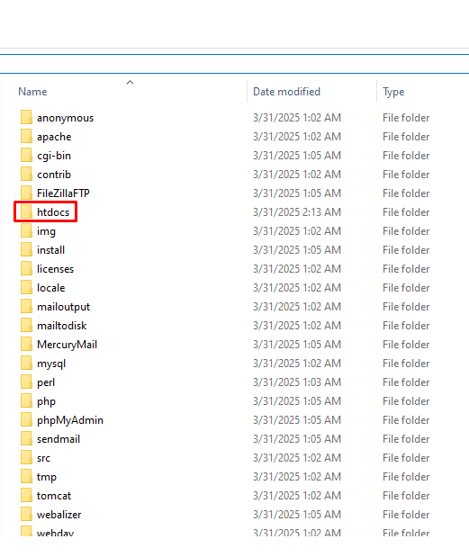

# Diceware Password Generator PHP
## 📷 Demo

https://github.com/user-attachments/assets/88910206-1e4b-4e41-818c-b7be3f5ba843

## 🎲 Diceware Method

Diceware is a simple method to create strong, random passwords using dice and a list of words. The big difference between this method and others (like generating random characters) is you can actually remember your password without needing a password manager, while still being protected against brute-force attacks.

### Why Does Diceware Work?

The length of a password is a major factor in protecting against brute-force attacks. A longer password takes much more time to crack. With Diceware, you build a long password using real words, making it both secure and memorable.
For example, the three shortest words from the word list I generated for this project are:

1. VAR
2. Sub
3. Red

Even with short words, the total length adds up, making the password stronger.

### Roll Dice to Pick Words

- 1 die → 6 possible outcomes (1-6)

- 2 dice → 36 possible outcomes (6 × 6 = 36)

- 3 dice → 216 possible outcomes (6 × 6 × 6 = 216)

> The more dice you roll, the bigger the list of words you can pick from, making your password more secure.

### Generating a Password with 3 Words & 2 Dice

In this project I used 36 words, it means we are using 2 dice. We roll two dice three times to select 3 words for our password

1. Rolling 3 & 4 → Look at position 34 in the word list → “Corner”
2. Rolling 1 & 2 → Look at position 12 → “Goal”
3. Rolling 5 & 6 → Look at position 56 → “Playmaker”

Our final password: `@Corner Goal Playmaker` 

### Importance of Special Character

A simple but effective trick to make your password even stronger is adding a special character at the beginning.

Remember when you saw that your password could take 3,000 years to crack? Look at how much the time decreases without that special character.

## 💻 Requirement

You will need a server to run the PHP file, you can simulate this with `XAMPP`.

### Installing

1. Download the [XAMPP Installer EXE](https://www.apachefriends.org/download.html).

2. Install it.

3. After install `XAMPP`, click in Explorer Folder Icon.

4. Open `htdocs` folder.

5. Paste the files in there.

6. Search for `Edit the system environment variables`.

7. Click in `Environment Variables`.

8. Click in `Path`.

9. Click in `Edit`.

10. Click in `New`.

11. Paste the path of `PHP` in XAMPP.

12. Click in `Move Up`.

13. Back to the XAMPP, hit `Start` to initiate the service.

14. Enter `localhost` in the browser.

## 🤝 Contribute with the Project

Want to be part of the project? Click [HERE](CONTRIBUTING.md) and read how to contribute.

## 📝 License

This project is under license. See the [LICENSE](LICENSE.md) file for more details.
